## 1.单纯形法算法原理

### 1.1 标准化

**第一阶段**：对于变量$x$的约束进行标准化；

无约束的$x$拆分为$x=x_1-x_2$，约束为小于等于的则用其相反数将其替换；

**第二阶段**：对约束条件进行标准化；

将约束矩阵进行行交换，重新排列为大于等于约束在上，等于约束在中间，小于等于约束在下的形式；

对于大于等于的约束，添加$-x$作为松弛变量，并添加$x$作为人工变量；

对于等于的约束，添加$x$作为人工变量；

对于小于等于的约束，添加$x$作为松弛变量；


### 1.2 计算

计算采用两阶段法计算：

第一阶段以$min\Sigma_i\bar{x_i}$为目标函数，其中$\bar{x_i}$为人工变量。

函数`def __init__(self, A, b, d, c, e):`根据标准化输入构建单纯形表，并为第一阶段做准备（即设置好第一阶段的初始检验数）


**NOTICE**：由于目标函数是最小化函数（而且本程序的默认输入也是最小化函数），为了方便起见，检验数采用$z_i-c_i$的形式，而不是课上讲述的$c_i-z_i$形式。这样判断最优解的条件依然时检验数均小于等于0即可。


两阶段法的每一阶段的计算方式均是相同的，均通过`def solve(self)`以及`def calculate(self)`函数实现。前者通过迭代调用后者，直到最优为止。

`def solve(self)`内只需要判断检验数是否均小于0，或者检测到无界解的情况，二者都会使循环终止。

`def calculate(self)`中，实现入基变量的选择以及出基变量的选择。

入基变量选择检验数最大的变量；出基变量选择$b_i/a_{ij}$最小的变量，其中$a_{ij}$大于0。

注意当没有入基变量可以选择，即这一变量对应的系数都是非正的，那么意味着出现了无界解，此时应该结束计算，告知程序无界解的出现。下方代码就是在选择出基变量的过程中，判断无界解的过程。

```python
noMoreThanZero=True
#选择出基变量
for i in range(0, self.con_num):
    if self.T[i][j_num] <= 0:
        D.append(float("inf"))
        else:
            noMoreThanZero=False
            D.append(self.T[i][-1] / self.T[i][j_num])
# 判断无界解
if noMoreThanZero : 
	return 0
```

如果能够确定入基以及出基变量，就进行换基迭代。


在两阶段法的一二阶段交接处，函数`def change(self)`用于判断是否有解，若有解则进行第二阶段的准备。

有解的充要条件为，基变量中如果存在人工变量，则人工变量值一定为0（若人工变量不再基变量中则显然为0，无需检验）。

故检查这一条件，判断是否有解,下方代码为判断无解的代码。

```python
for i in range(0,self.con_num):
    if self.sign[i] in range(self.var_num+self.more_count,self.var_num+self.more_count+self.artiV_num):
        if self.T[i][-1]!=0:
            return 0
```

如果发现有解，则消去人工变量——将人工变量所在的列置为0，随后将检验数重新替换为计算目标函数所需要的检验数。


第二阶段结束后，就可以输出结果，此时需要注意，如果先前存在无约束的变量$x$，此时需要将其拆分的两个子变量$x=x_1-x_2$重新结合回去。在标准化时通过一个元组维护了每个被拆分的变量的两个自变量的位置，借此将其还原。

```python
if self.Q.x_no_cons.size==0:
            print(result)
else:#存在被拆分的变量，将其还原。
    for i in range(0,int(self.Q.x_no_cons.size/2)):
        new_x=result[int(self.Q.x_no_cons[2*i])]-result[int(self.Q.x_no_cons[2*i+1])]
        result[int(self.Q.x_no_cons[2*i])]=new_x
        print(result[:int(-self.Q.x_no_cons.size/2)])
        result=result[:int(-self.Q.x_no_cons.size/2)]
```


### **2.单纯形法程序测试**

工程中提供有标准的线性规划求解器，通过与之对比可以体现本程序的正确性：

以下的输入均可见testdata文件,单纯形法的输出在testResult中，带有后缀simplex.out。

对照的正确答案会输出在testAnswer中。

**NOTICE：**程序执行的过程同时会计算时间，可以在终端界面中得到关于时间的数据，测试样例中对于大规模程序会说明其执行时间。

**输入样例1：一般输入example.out**

程序输出：

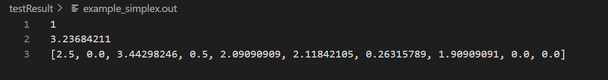

正确输出：

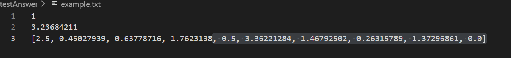

**输入样例2：无解输入infeasible.txt**

程序输出：

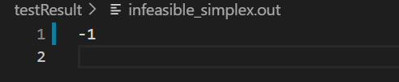

正确输出

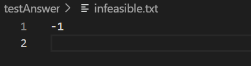

**输入样例3：无界解输入unbounded.txt**

程序输出：

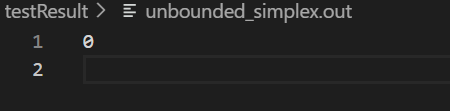

正确输出：

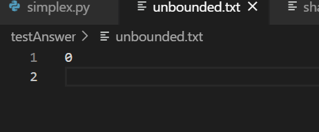

**输入样例4：大规模输入1： share1b.txt   规模为225*117**

程序输入：

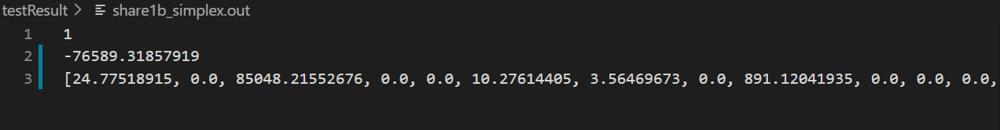

正确输出：

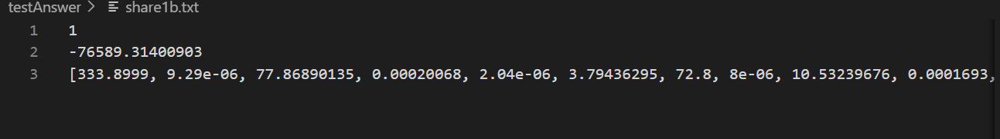

测试用时：1.0204083s

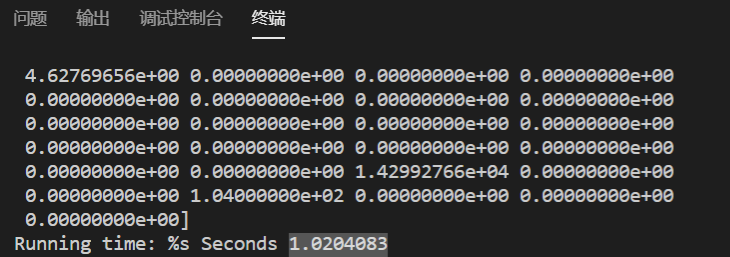


**输入样例4：大规模输入2： agg3.txt   规模为302*516**

程序输出：

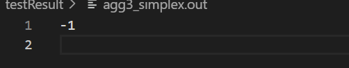

正确输出

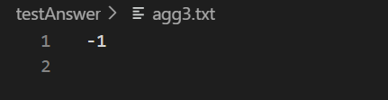

正确输出：

测试用时：2.4179984s

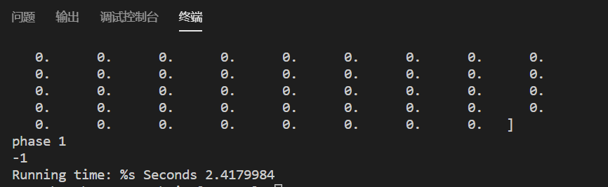


更多的测试样例，可以在工程文件内找到，按照说明执行即可。
